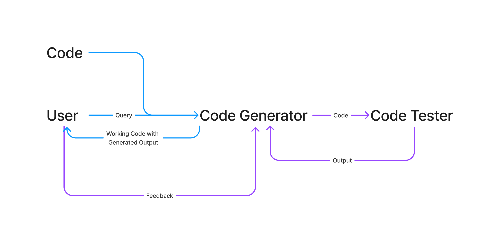

<a href="https://mernifier-web.vercel.app/">
    <h1>MERNavigator</h1>
</a>

<h2>
Don't be Shy, try it out yourself!

**Link:** [https://mernifier-web.vercel.app/](https://mernifier-web.vercel.app/)
</h2>

<h2>
    Tired of using Code Helpers which give Code filled with errors?
</h2>
<h2>
    Introducing MERNavigator
</h2>

<p >
    Experience GPT-4's superior capabilities in a smaller Lite Chatbot, ideal for engaging, advanced conversations in MERN-based AI assistance.
</p>

<p >
  <a href="#description"><strong>Description</strong></a> ·
  <a href="#features"><strong>Features</strong></a> ·
  <a href="#mind-boggling-features"><strong>Mind-Boggling Features</strong></a> ·
  <a href="#running-locally"><strong>Running locally</strong></a> ·
  <a href="#future-scope"><strong>Future Scope</strong></a> ·
</p>
<br/>

## Description

Powered by the SOTA Multi-Agent-Based Architectures, our AI bot delivers Accurate, Reliable, and most importantly, 100% error-free code. Accessible by an intuitive web interface, our AI bot might appear to be just another AI bot but underneath there is a whole symphony of workflows and backend black magic that goes on to make it the best AI Code Generator for MERN tasks. The code generation agent creates the code, which is then passed to the testing agent. The testing agent runs the code at its end and if any errors are detected, they're reported to the main agent for code regeneration. If the code is error-free, it's executed and presented to the user. User feedback is welcomed for continuous improvement.

// Video One, Regen


textfs

// With File


https://github.com/korebhaumik/mernifier-web/assets/91827941/0307c610-240b-4319-bb31-bb5100600bce


https://github.com/korebhaumik/mernifier-web/assets/91827941/cbc2be9e-97b1-4bf0-adb5-47fd19a330d3


// With Audio


## Features


- [Sveltekit](https://kit.svelte.dev/) App Router
- Svelte 3.x and [Typescript](https://vercel.com/ai) for reliable and fast development
- [Vercel Edge Adapter]() for Edge runtime compatibility
- User Interface and Experience
  - Design is built from scratch using [Figma](https://www.figma.com/)
  - Styling with [Tailwind CSS](https://tailwindcss.com)
  - Icons from [Heroicons](https://heroicons.com) and [Google Icons](https://fonts.google.com/icons)


## Mind-Boggling Features



- Tired of AI generated codes with errors? reliably generate error-free MERN Code
- Experience the Incredible Profeciency of a Bot trained to do one thing and one thing only, generate MERN code
- Integrate our Bot seamlessly using our beautiful easy-to-use website and our sophisticated VSCode Extension (Coming Soon)
- Got a code file you wanna edit or add code into? We got you covered, just upload your file and prompt and see the magic happen.
- Too tired to type? Just speak it out loud and our AI understands you!

## Running locally

You will need to have the necessary environment variables setup in your `.env` file.
This include keys for your Supabase account, and Stripe account, Github Outh Client, Github Outh Secret. 
    
```bash
HOST =
GITHUB_CLIENT_ID =
GITHUB_CLIENT_SECRET =
```

> Note: You should not commit your `.env` file or it will expose secrets that will allow others to control access to your authentication provider accounts.

1. Install run: `pnpm i`
2. Make a new `.env` file.
3. Populate the `.env` file with the necessary environment variables.

```bash
pnpm run dev
```

Your app template should now be running on [localhost:5173](http://localhost:5173/).

## Running locally with docker

```bash
docker login
docker pull korebhaumik/mernifier-web.
docker run -env-file .env -p 3000:3000 korebhaumik/mernifier-web
```

> Note: If the docker image is not available (repo is privated), you can build it locally by running `docker build -t mernifier-web .` in the root directory of the project.


## Future Scope

- Using Specially Finetuned LLMs:
    Finetuning LLMs for MERN specific Code generation will yield far better results than current multi-modal LLMs.

- Local Deployment of LLM:
    Local Finetuning and Deployment of LLMs through tools like H20.ai LLM Studio for additional security and safe corporate usage.

- Generation of End to End Projects by incorporating more Agents:
    Creation of Files and Database Connectivity prospects in the future can give the AI the 	ability to generate end to end projects.

- Better Support for a more Beautiful UI:
    Future updates will include support for uploading a website image and getting a clone of that website made in seconds, yes this will replace frontend developers.
